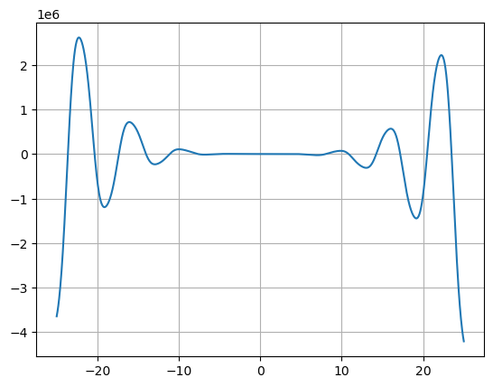
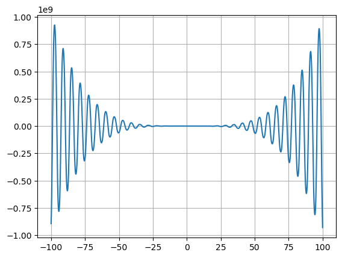
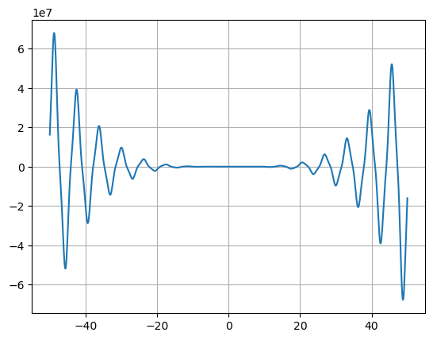
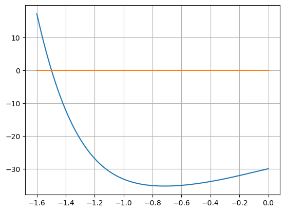

```python
#f(x) = -12x^4*sin(cos(x)) - 18x^3+5x^2 + 10x - 30

#Определить корни❌

#Найти интервалы, на которых функция возрастает 


#Найти интервалы, на которых функция убывает

#Построить график ✔️

#Вычислить вершину

#Определить промежутки, на котором f > 0 ❌(нужны корни)

#Определить промежутки, на котором f < 0❌(нужны корни)

#f=((-12)*(x**4)*np.sin(np.cos(x)))-18*(x**3)+(5*(x**2))+10*x-30
#def F(x):
#    return (((-12)*(x**4)*np.sin(np.cos(x)))-18*(x**3)+(5*(x**2))+10*x-30)
```


```python
# Для того,чтобы понять,что из себя представляет данная функция попробуеи построить график

import numpy as np
import matplotlib.pyplot as plt


xi=np.linspace(-25,25,1000)

```


```python
y = [(-12*x**4*np.sin(np.cos(x)) )- (18*x**3+5*x**2) + 10*x - 30 for x in xi]
plt.plot(xi, y)

plt.grid()
plt.show()

```


    

    


```python
#Для наглядности попробуем увеличить количество значений
xj=np.linspace(-100,100,1000)
y = [((-12)*(x**4)*np.sin(np.cos(x)))-18*(x**3)+(5*(x**2))+10*x-30 for x in xj]
plt.plot(xj, y)

plt.grid()
plt.show()

```


    

    


```python
#Определить корни

#При поиске корней sympay выдает ошибку(No algorithms are implemented to solve equation)
#А тк , если разбить функцию на 2 ,oн может их решить,то попробуем с помощью графиков
#Исходя из вида функции можем сделать вывод,что корней бесконечное количество
#oшибка быглядит точно также при записи fun=(-12*x**4)*sin(cos(x)) )- (18*x**3)+(5*x**2) + 10*x - 30

from sympy import *
from sympy.plotting import plot
init_printing()
x = Symbol('x')
a=sin(cos(x)) 
b=-18*x*x*x+ 5*x*x+ 10*x - 30
c=(-12*x**4)
fun =a*c+b
root =solveset(fun)
print(root)
```

    ConditionSet(x, Eq(-12*x**4*sin(cos(x)) - 18*x**3 + 5*x**2 + 10*x - 30, 0), Complexes)
    


```python
fun =a*c+b
root =solve(fun)
print(root)
```


    ---------------------------------------------------------------------------

    NotImplementedError                       Traceback (most recent call last)

    ~\AppData\Local\Temp\ipykernel_12760\1962392075.py in <module>
          1 fun =a*c+b
    ----> 2 root =solve(fun)
          3 print(root)
    

    ~\anaconda3\lib\site-packages\sympy\solvers\solvers.py in solve(f, *symbols, **flags)
       1104     ###########################################################################
       1105     if bare_f:
    -> 1106         solution = _solve(f[0], *symbols, **flags)
       1107     else:
       1108         solution = _solve_system(f, symbols, **flags)
    

    ~\anaconda3\lib\site-packages\sympy\solvers\solvers.py in _solve(f, *symbols, **flags)
       1718 
       1719     if result is False:
    -> 1720         raise NotImplementedError('\n'.join([msg, not_impl_msg % f]))
       1721 
       1722     if flags.get('simplify', True):
    

    NotImplementedError: multiple generators [x, sin(cos(x))]
    No algorithms are implemented to solve equation -12*x**4*sin(cos(x)) - 18*x**3 + 5*x**2 + 10*x - 30


```python
#пример корректной работы 
fun =a*c
root =solveset(fun)
print(root)
```

    Union(ConditionSet(x, Eq(sin(cos(x)), 0), Complexes), {0})
    


```python
#пример корректной работы 
fun =a*c
root =solve(fun)
print(root)
```

    [0, pi/2, 3*pi/2, 2*pi - acos(pi), acos(pi)]
    


```python
#пример корректной работы 
fun =b
root =solve(fun)
print(root)
```

    [5/54 - 565/(972*(-1/2 - sqrt(3)*I/2)*(5*sqrt(218931)/108 + 127045/5832)**(1/3)) - (-1/2 - sqrt(3)*I/2)*(5*sqrt(218931)/108 + 127045/5832)**(1/3)/3, 5/54 - (-1/2 + sqrt(3)*I/2)*(5*sqrt(218931)/108 + 127045/5832)**(1/3)/3 - 565/(972*(-1/2 + sqrt(3)*I/2)*(5*sqrt(218931)/108 + 127045/5832)**(1/3)), -(5*sqrt(218931)/108 + 127045/5832)**(1/3)/3 - 565/(972*(5*sqrt(218931)/108 + 127045/5832)**(1/3)) + 5/54]
    


```python
#Найти интервалы, на которых функция возрастает ✔️
#Т.к. резкий излом функции на графике можно определить взяв производную,то

fun = a*c-b
dfun=diff(fun)
print(dfun)
```

    12*x**4*sin(x)*cos(cos(x)) - 48*x**3*sin(cos(x)) + 54*x**2 - 10*x - 10
    


```python
root =solve(dfun)
print(root)
```


    ---------------------------------------------------------------------------

    KeyboardInterrupt                         Traceback (most recent call last)

    ~\AppData\Local\Temp\ipykernel_12760\2954606933.py in <module>
    ----> 1 root =solve(dfun)
          2 print(root)
    

    ~\anaconda3\lib\site-packages\sympy\solvers\solvers.py in solve(f, *symbols, **flags)
       1104     ###########################################################################
       1105     if bare_f:
    -> 1106         solution = _solve(f[0], *symbols, **flags)
       1107     else:
       1108         solution = _solve_system(f, symbols, **flags)
    

    ~\anaconda3\lib\site-packages\sympy\solvers\solvers.py in _solve(f, *symbols, **flags)
       1554                         # solutions in the un-rewritten form below
       1555                         flags['check'] = False
    -> 1556                         result = _solve(newf, symbol, **flags)
       1557                         flags['check'] = check
       1558 
    

    ~\anaconda3\lib\site-packages\sympy\solvers\solvers.py in _solve(f, *symbols, **flags)
       1554                         # solutions in the un-rewritten form below
       1555                         flags['check'] = False
    -> 1556                         result = _solve(newf, symbol, **flags)
       1557                         flags['check'] = check
       1558 
    

    ~\anaconda3\lib\site-packages\sympy\solvers\solvers.py in _solve(f, *symbols, **flags)
       1710         flags.pop('tsolve', None)  # allow tsolve to be used on next pass
       1711         try:
    -> 1712             soln = _tsolve(f_num, symbol, **flags)
       1713             if soln is not None:
       1714                 result = soln
    

    ~\anaconda3\lib\site-packages\sympy\solvers\solvers.py in _tsolve(eq, sym, **flags)
       2564             f = factor(powdenest(lhs - rhs))
       2565             if f.is_Mul:
    -> 2566                 return _solve(f, sym, **flags)
       2567             if rhs:
       2568                 f = logcombine(lhs, force=flags.get('force', True))
    

    ~\anaconda3\lib\site-packages\sympy\solvers\solvers.py in _solve(f, *symbols, **flags)
       1392                 result = set()
       1393                 break
    -> 1394             soln = _solve(m, symbol, **flags)
       1395             result.update(set(soln))
       1396         result = list(result)
    

    ~\anaconda3\lib\site-packages\sympy\solvers\solvers.py in _solve(f, *symbols, **flags)
       1710         flags.pop('tsolve', None)  # allow tsolve to be used on next pass
       1711         try:
    -> 1712             soln = _tsolve(f_num, symbol, **flags)
       1713             if soln is not None:
       1714                 result = soln
    

    ~\anaconda3\lib\site-packages\sympy\solvers\solvers.py in _tsolve(eq, sym, **flags)
       2683         rewrite = lhs.rewrite(exp)
       2684         if rewrite != lhs:
    -> 2685             return _solve(rewrite - rhs, sym, **flags)
       2686     except NotImplementedError:
       2687         pass
    

    ~\anaconda3\lib\site-packages\sympy\solvers\solvers.py in _solve(f, *symbols, **flags)
       1710         flags.pop('tsolve', None)  # allow tsolve to be used on next pass
       1711         try:
    -> 1712             soln = _tsolve(f_num, symbol, **flags)
       1713             if soln is not None:
       1714                 result = soln
    

    ~\anaconda3\lib\site-packages\sympy\solvers\solvers.py in _tsolve(eq, sym, **flags)
       2564             f = factor(powdenest(lhs - rhs))
       2565             if f.is_Mul:
    -> 2566                 return _solve(f, sym, **flags)
       2567             if rhs:
       2568                 f = logcombine(lhs, force=flags.get('force', True))
    

    ~\anaconda3\lib\site-packages\sympy\solvers\solvers.py in _solve(f, *symbols, **flags)
       1392                 result = set()
       1393                 break
    -> 1394             soln = _solve(m, symbol, **flags)
       1395             result.update(set(soln))
       1396         result = list(result)
    

    ~\anaconda3\lib\site-packages\sympy\solvers\solvers.py in _solve(f, *symbols, **flags)
       1710         flags.pop('tsolve', None)  # allow tsolve to be used on next pass
       1711         try:
    -> 1712             soln = _tsolve(f_num, symbol, **flags)
       1713             if soln is not None:
       1714                 result = soln
    

    ~\anaconda3\lib\site-packages\sympy\solvers\solvers.py in _tsolve(eq, sym, **flags)
       2562             # it's time to try factoring; powdenest is used
       2563             # to try get powers in standard form for better factoring
    -> 2564             f = factor(powdenest(lhs - rhs))
       2565             if f.is_Mul:
       2566                 return _solve(f, sym, **flags)
    

    ~\anaconda3\lib\site-packages\sympy\polys\polytools.py in factor(f, deep, *gens, **args)
       6451 
       6452     try:
    -> 6453         return _generic_factor(f, gens, args, method='factor')
       6454     except PolynomialError as msg:
       6455         if not f.is_commutative:
    

    ~\anaconda3\lib\site-packages\sympy\polys\polytools.py in _generic_factor(expr, gens, args, method)
       6132     opt = options.build_options(gens, args)
       6133     opt['fraction'] = fraction
    -> 6134     return _symbolic_factor(sympify(expr), opt, method)
       6135 
       6136 
    

    ~\anaconda3\lib\site-packages\sympy\polys\polytools.py in _symbolic_factor(expr, opt, method)
       6072         if hasattr(expr,'_eval_factor'):
       6073             return expr._eval_factor()
    -> 6074         coeff, factors = _symbolic_factor_list(together(expr, fraction=opt['fraction']), opt, method)
       6075         return _keep_coeff(coeff, _factors_product(factors))
       6076     elif hasattr(expr, 'args'):
    

    ~\anaconda3\lib\site-packages\sympy\polys\polytools.py in _symbolic_factor_list(expr, opt, method)
       6037             func = getattr(poly, method + '_list')
       6038 
    -> 6039             _coeff, _factors = func()
       6040             if _coeff is not S.One:
       6041                 if exp.is_Integer:
    

    ~\anaconda3\lib\site-packages\sympy\polys\polytools.py in factor_list(f)
       3351         if hasattr(f.rep, 'factor_list'):
       3352             try:
    -> 3353                 coeff, factors = f.rep.factor_list()
       3354             except DomainError:
       3355                 return S.One, [(f, 1)]
    

    ~\anaconda3\lib\site-packages\sympy\polys\polyclasses.py in factor_list(f)
        821     def factor_list(f):
        822         """Returns a list of irreducible factors of ``f``. """
    --> 823         coeff, factors = dmp_factor_list(f.rep, f.lev, f.dom)
        824         return coeff, [ (f.per(g), k) for g, k in factors ]
        825 
    

    ~\anaconda3\lib\site-packages\sympy\polys\factortools.py in dmp_factor_list(f, u, K0)
       1389         coeff, factors = dmp_ext_factor(f, u, K0)
       1390     elif K0.is_GaussianRing:
    -> 1391         coeff, factors = dmp_zz_i_factor(f, u, K0)
       1392     elif K0.is_GaussianField:
       1393         coeff, factors = dmp_qq_i_factor(f, u, K0)
    

    ~\anaconda3\lib\site-packages\sympy\polys\factortools.py in dmp_zz_i_factor(f, u, K0)
       1204     K1 = K0.get_field()
       1205     f = dmp_convert(f, u, K0, K1)
    -> 1206     coeff, factors = dmp_qq_i_factor(f, u, K1)
       1207 
       1208     new_factors = []
    

    ~\anaconda3\lib\site-packages\sympy\polys\factortools.py in dmp_qq_i_factor(f, u, K0)
       1193     K1 = K0.as_AlgebraicField()
       1194     f = dmp_convert(f, u, K0, K1)
    -> 1195     coeff, factors = dmp_factor_list(f, u, K1)
       1196     factors = [(dmp_convert(fac, u, K1, K0), i) for fac, i in factors]
       1197     coeff = K0.convert(coeff, K1)
    

    ~\anaconda3\lib\site-packages\sympy\polys\factortools.py in dmp_factor_list(f, u, K0)
       1387         coeff, factors = dmp_gf_factor(f, u, K0)
       1388     elif K0.is_Algebraic:
    -> 1389         coeff, factors = dmp_ext_factor(f, u, K0)
       1390     elif K0.is_GaussianRing:
       1391         coeff, factors = dmp_zz_i_factor(f, u, K0)
    

    ~\anaconda3\lib\site-packages\sympy\polys\factortools.py in dmp_ext_factor(f, u, K)
       1263         return lc, []
       1264 
    -> 1265     f, F = dmp_sqf_part(f, u, K), f
       1266     s, g, r = dmp_sqf_norm(f, u, K)
       1267 
    

    ~\anaconda3\lib\site-packages\sympy\polys\sqfreetools.py in dmp_sqf_part(f, u, K)
        254     gcd = f
        255     for i in range(u+1):
    --> 256         gcd = dmp_gcd(gcd, dmp_diff_in(f, 1, i, u, K), u, K)
        257     sqf = dmp_quo(f, gcd, u, K)
        258 
    

    ~\anaconda3\lib\site-packages\sympy\polys\euclidtools.py in dmp_gcd(f, g, u, K)
       1622 
       1623     """
    -> 1624     return dmp_inner_gcd(f, g, u, K)[0]
       1625 
       1626 
    

    ~\anaconda3\lib\site-packages\sympy\polys\euclidtools.py in dmp_inner_gcd(f, g, u, K)
       1581 
       1582     J, (f, g) = dmp_multi_deflate((f, g), u, K)
    -> 1583     h, cff, cfg = _dmp_inner_gcd(f, g, u, K)
       1584 
       1585     return (dmp_inflate(h, J, u, K),
    

    ~\anaconda3\lib\site-packages\sympy\polys\euclidtools.py in _dmp_inner_gcd(f, g, u, K)
       1546                 pass
       1547 
    -> 1548         return dmp_ff_prs_gcd(f, g, u, K)
       1549     else:
       1550         if K.is_ZZ and query('USE_HEU_GCD'):
    

    ~\anaconda3\lib\site-packages\sympy\polys\euclidtools.py in dmp_ff_prs_gcd(f, g, u, K)
       1111     gc, G = dmp_primitive(g, u, K)
       1112 
    -> 1113     h = dmp_subresultants(F, G, u, K)[-1]
       1114     c, _, _ = dmp_ff_prs_gcd(fc, gc, u - 1, K)
       1115 
    

    ~\anaconda3\lib\site-packages\sympy\polys\euclidtools.py in dmp_subresultants(f, g, u, K)
        548 
        549     """
    --> 550     return dmp_inner_subresultants(f, g, u, K)[0]
        551 
        552 
    

    ~\anaconda3\lib\site-packages\sympy\polys\euclidtools.py in dmp_inner_subresultants(f, g, u, K)
        511                     dmp_pow(c, d, v, K), v, K)
        512 
    --> 513         h = dmp_prem(f, g, u, K)
        514         h = [ dmp_quo(ch, b, v, K) for ch in h ]
        515 
    

    ~\anaconda3\lib\site-packages\sympy\polys\densearith.py in dmp_prem(f, g, u, K)
       1235         j, N = dr - dg, N - 1
       1236 
    -> 1237         R = dmp_mul_term(r, lc_g, 0, u, K)
       1238         G = dmp_mul_term(g, lc_r, j, u, K)
       1239         r = dmp_sub(R, G, u, K)
    

    ~\anaconda3\lib\site-packages\sympy\polys\densearith.py in dmp_mul_term(f, c, i, u, K)
        182         return dmp_zero(u)
        183     else:
    --> 184         return [ dmp_mul(cf, c, v, K) for cf in f ] + dmp_zeros(i, v, K)
        185 
        186 
    

    ~\anaconda3\lib\site-packages\sympy\polys\densearith.py in <listcomp>(.0)
        182         return dmp_zero(u)
        183     else:
    --> 184         return [ dmp_mul(cf, c, v, K) for cf in f ] + dmp_zeros(i, v, K)
        185 
        186 
    

    ~\anaconda3\lib\site-packages\sympy\polys\densearith.py in dmp_mul(f, g, u, K)
        826 
        827         for j in range(max(0, i - dg), min(df, i) + 1):
    --> 828             coeff = dmp_add(coeff, dmp_mul(f[j], g[i - j], v, K), v, K)
        829 
        830         h.append(coeff)
    

    ~\anaconda3\lib\site-packages\sympy\polys\densearith.py in dmp_add(f, g, u, K)
        576 
        577     if df == dg:
    --> 578         return dmp_strip([ dmp_add(a, b, v, K) for a, b in zip(f, g) ], u)
        579     else:
        580         k = abs(df - dg)
    

    ~\anaconda3\lib\site-packages\sympy\polys\densearith.py in <listcomp>(.0)
        576 
        577     if df == dg:
    --> 578         return dmp_strip([ dmp_add(a, b, v, K) for a, b in zip(f, g) ], u)
        579     else:
        580         k = abs(df - dg)
    

    ~\anaconda3\lib\site-packages\sympy\polys\densearith.py in dmp_add(f, g, u, K)
        576 
        577     if df == dg:
    --> 578         return dmp_strip([ dmp_add(a, b, v, K) for a, b in zip(f, g) ], u)
        579     else:
        580         k = abs(df - dg)
    

    ~\anaconda3\lib\site-packages\sympy\polys\densearith.py in <listcomp>(.0)
        576 
        577     if df == dg:
    --> 578         return dmp_strip([ dmp_add(a, b, v, K) for a, b in zip(f, g) ], u)
        579     else:
        580         k = abs(df - dg)
    

    ~\anaconda3\lib\site-packages\sympy\polys\densearith.py in dmp_add(f, g, u, K)
        565     df = dmp_degree(f, u)
        566 
    --> 567     if df < 0:
        568         return g
        569 
    

    ~\anaconda3\lib\site-packages\sympy\core\decorators.py in _func(self, other)
        234             if not isinstance(other, expectedcls):
        235                 return retval
    --> 236             return func(self, other)
        237 
        238         return _func
    

    ~\anaconda3\lib\site-packages\sympy\core\expr.py in __lt__(self, other)
        368     def __lt__(self, other):
        369         from .relational import StrictLessThan
    --> 370         return StrictLessThan(self, other)
        371 
        372     def __trunc__(self):
    

    ~\anaconda3\lib\site-packages\sympy\core\relational.py in __new__(cls, lhs, rhs, **options)
        843             # exception).  In that case, it must call us with
        844             # `evaluate=False` to prevent infinite recursion.
    --> 845             return cls._eval_relation(lhs, rhs, **options)
        846 
        847         # make a "non-evaluated" Expr for the inequality
    

    ~\anaconda3\lib\site-packages\sympy\core\relational.py in _eval_relation(cls, lhs, rhs, **options)
        850     @classmethod
        851     def _eval_relation(cls, lhs, rhs, **options):
    --> 852         val = cls._eval_fuzzy_relation(lhs, rhs)
        853         if val is None:
        854             return cls(lhs, rhs, evaluate=False)
    

    ~\anaconda3\lib\site-packages\sympy\core\relational.py in _eval_fuzzy_relation(cls, lhs, rhs)
       1175     rel_op = '<'
       1176 
    -> 1177     @classmethod
       1178     def _eval_fuzzy_relation(cls, lhs, rhs):
       1179         return is_lt(lhs, rhs)
    

    KeyboardInterrupt: 


```python
xi=np.linspace(-50,50,1000)
y = [12*x**4*np.sin(x)*np.cos(np.cos(x)) - 48*x**3*np.sin(np.cos(x)) + 54*x**2 - 10*x - 10 for x in xi]
plt.plot(xi, y)

plt.grid()
plt.show()
```


    

    


```python
for x in range(-20,20):
    fun =a*c+b
    root =solve(fun)
    print(root)
```


    ---------------------------------------------------------------------------

    NotImplementedError                       Traceback (most recent call last)

    ~\AppData\Local\Temp\ipykernel_12760\233839297.py in <module>
          1 for x in range(-20,20):
          2     fun =a*c+b
    ----> 3     root =solve(fun)
          4     print(root)
    

    ~\anaconda3\lib\site-packages\sympy\solvers\solvers.py in solve(f, *symbols, **flags)
       1104     ###########################################################################
       1105     if bare_f:
    -> 1106         solution = _solve(f[0], *symbols, **flags)
       1107     else:
       1108         solution = _solve_system(f, symbols, **flags)
    

    ~\anaconda3\lib\site-packages\sympy\solvers\solvers.py in _solve(f, *symbols, **flags)
       1718 
       1719     if result is False:
    -> 1720         raise NotImplementedError('\n'.join([msg, not_impl_msg % f]))
       1721 
       1722     if flags.get('simplify', True):
    

    NotImplementedError: multiple generators [x, sin(cos(x))]
    No algorithms are implemented to solve equation -12*x**4*sin(cos(x)) - 18*x**3 + 5*x**2 + 10*x - 30


```python
xi=np.linspace(-1.6,0,1000)
y = [(-12*x**4*np.sin(np.cos(x)) )- (18*x**3+5*x**2) + 10*x - 30 for x in xi]
q = [0*x  for x in xi]
plt.plot(xi, y)
plt.plot(xi, q)


plt.grid()
plt.show()
```


    

    


```python
f=((-12)*(x**4)*sin(cos(x)))-18*(x**3)+(5*(x**2))+10*x-30 
f.subs(x,-1.5)
#попытка поймать значение по графику
```


$\displaystyle 10067.8089098144$


```python

```
