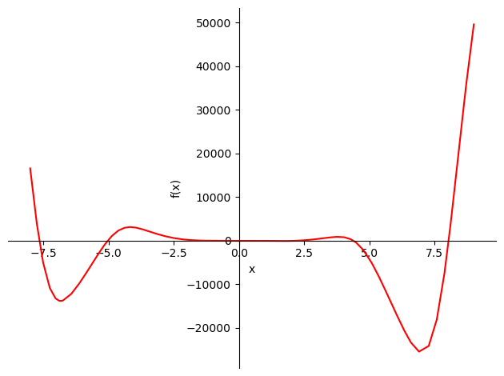
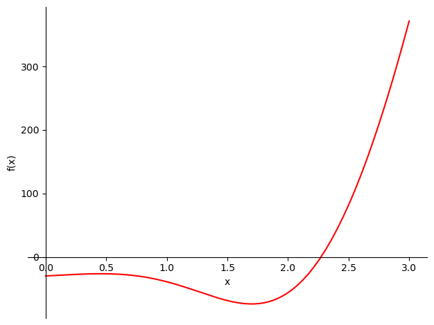
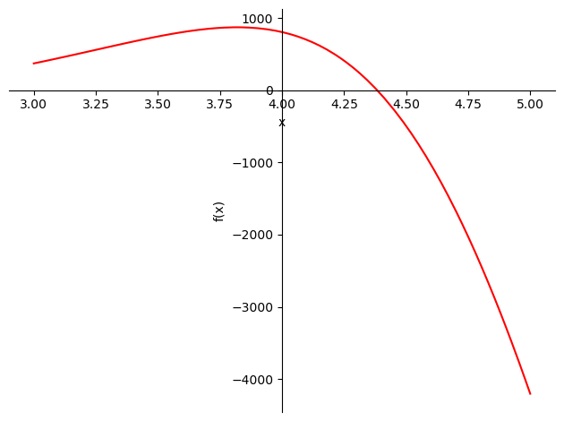

```python
#f(x) = -12x^4*sin(cos(x)) - 18x^3+5x^2 + 10x - 30

#Определить корни ✔️

#Найти интервалы, на которых функция возрастает ✔️

#Найти интервалы, на которых функция убывает✔️

#Построить график ✔️

#Вычислить вершину ✔️

#Определить промежутки, на котором f > 0 ✔️

#Определить промежутки, на котором f < 0 ✔️
```


```python
# Для того,чтобы понять,что из себя представляет данная функция попробуем построить график

import numpy as np
import matplotlib.pyplot as plt


xi=np.linspace(-25,25,1000)

```


```python
y = [(-12*x**4*np.sin(np.cos(x)) )- (18*x**3+5*x**2) + 10*x - 30 for x in xi]
plt.plot(xi, y)

plt.grid()
plt.show()

```


    

    


```python
#Для наглядности попробуем увеличить количество значений
xj=np.linspace(-100,100,1000)
y = [((-12)*(x**4)*np.sin(np.cos(x)))-18*(x**3)+(5*(x**2))+10*x-30 for x in xj]
plt.plot(xj, y)

plt.grid()
plt.show()

```


    

    


```python
#Определить корни


from sympy import *
from sympy.plotting import plot
%matplotlib inline
init_printing()
x = Symbol('x')


#Т.к. библиотека sympy не может найти корни нашей функции,то попробуем их найти с помощью графика
```


```python
fun=-12*x**4*sin(cos(x)) - 18*x**3 + 5*x**2 + 10*x - 30 
plot(fun,(x,-8,9),line_color='red')

# Работать будем на промежутке (-8;9),т.к. функция имеет бесконечное количество корней,и при удалении от 0 они находятся
# все ближе друг к другу
```


    

    


    <sympy.plotting.plot.Plot at 0x209caf57c70>


```python
#Исходя из графика,мы видим,что первый корень находится на промежутке (-8;7.5)
plot(fun,(x,-8,-7.5),line_color='red')
```


    

    


    <sympy.plotting.plot.Plot at 0x209cc12fa90>


```python
plot(fun,(x,-7.7,-7.6),line_color='red')
```


    

    


    <sympy.plotting.plot.Plot at 0x209cc282250>


```python
#Попробуем расчитать приблизительное значение корня
roots=[]
root=nsolve(fun,-7.65)
roots.append(root)
print(root)
```

    -7.65062228513275
    


```python
#Следующий корень находим на промежутке(-5.5;-4/5)
plot(fun,(x,-5.5,-4.5),line_color='red')
```


    

    


    <sympy.plotting.plot.Plot at 0x209caf7c040>


```python
root=nsolve(fun,-5.05)
roots.append(root)
print(root)
```

    -5.02686592820621
    


```python
plot(fun,(x,-2.5,-3),line_color='red')
```


    

    


    <sympy.plotting.plot.Plot at 0x209cb1421f0>


```python
plot(fun,(x,-2.8,-2.85),line_color='red')
```


    

    


    <sympy.plotting.plot.Plot at 0x209cc3ae370>


```python
root=nsolve(fun,-2.825)
roots.append(root)
print(root)
```

    -1.33896663927711
    


```python
plot(fun,(x,0,3),line_color='red')
```


    

    


    <sympy.plotting.plot.Plot at 0x209cc2e0340>


```python
plot(fun,(x,2,2.5),line_color='red')
```


    

    


    <sympy.plotting.plot.Plot at 0x209cd5bd760>


```python
plot(fun,(x,2.25,2.3),line_color='red')
```


    

    


    <sympy.plotting.plot.Plot at 0x209cc2c4160>


```python

```


```python
root=nsolve(fun,2.26)
roots.append(root)
print(root)
```

    2.27305684575625
    


```python
plot(fun,(x,3,5),line_color='red')
```


    

    


    <sympy.plotting.plot.Plot at 0x209cda7a640>


```python
root=nsolve(fun,4.3)
roots.append(root)
print(root)

```

    4.38352369796896
    


```python
plot(fun,(x,7.5,8.5),line_color='red')
```


    

    


    <sympy.plotting.plot.Plot at 0x209cd655cd0>


```python
root=nsolve(fun,8.1)
roots.append(root)
print(root)
```

    8.03516413341352
    


```python
print("На промежутке (-8;9) мы имеем "+str(len(roots)) +" корней:")
print(roots)
```

    На промежутке (-8;9) мы имеем 6 корней:
    [-7.65062228513275, -5.02686592820621, -1.33896663927711, 2.27305684575625, 4.38352369796896, 8.03516413341352]
    


```python
print("Функция имеет значения < 0 на промежутках: ")
print(f" ({roots[0]:.6f};{roots[1]:.6f})")
print(f" ({roots[2]:.6f};{roots[3]:.6f})")
print(f" ({roots[4]:.6f};{roots[5]:.6f})")
```

    Функция имеет значения < 0 на промежутках: 
     (-7.650622;-5.026866)
     (-1.338967;2.273057)
     (4.383524;8.035164)
    


```python
print("Функция имеет значения > 0 на промежутках: ")
print(f" ({roots[1]:.6f};{roots[2]:.6f})")
print(f" ({roots[3]:.6f};{roots[4]:.6f})")
```

    Функция имеет значения > 0 на промежутках: 
     (-5.026866;-1.338967)
     (2.273057;4.383524)
    


```python
#Найти интервалы, на которых функция возрастает 


#Т.к. резкий излом функции на графике можно определить взяв производную,то вычислим ее
dfun=diff(fun)
print(dfun)
```

    12*x**4*sin(x)*cos(cos(x)) - 48*x**3*sin(cos(x)) - 54*x**2 + 10*x + 10
    


```python
plot(dfun,(x,-8,9),line_color='green')
```


    

    


    <sympy.plotting.plot.Plot at 0x209cdb3d280>


```python
plot(dfun,(x,-7.5,-5),line_color='green')
```


    

    


    <sympy.plotting.plot.Plot at 0x209cdb04ac0>


```python
droots=[]
droot=nsolve(dfun,-6.8)
droots.append(droot)
print(droot)
```

    -6.83137004000085
    


```python
plot(dfun,(x,-5,-2.5),line_color='green')
```


    

    


    <sympy.plotting.plot.Plot at 0x209cdf7d160>


```python
droot=nsolve(dfun,-4.2)
droots.append(droot)
print(droot)
```

    -4.16778352385048
    


```python
plot(dfun,(x,-1.5,-0),line_color='green')
```


    

    


    <sympy.plotting.plot.Plot at 0x209cdf7d1c0>


```python
droot=nsolve(dfun,-0.4)
droots.append(droot)
print(droot)
```

    -0.392677179932750
    


```python
plot(dfun,(x,0.25,0.75),line_color='green')
```


    

    


    <sympy.plotting.plot.Plot at 0x209ce3c6460>


```python
droot=nsolve(dfun,0.5)
droots.append(droot)
print(droot)
```

    0.454573568108782
    


```python
plot(dfun,(x,1.5,2),line_color='green')
```


    

    


    <sympy.plotting.plot.Plot at 0x209ce0165b0>


```python
droot=nsolve(dfun,1.7)
droots.append(droot)
print(droot)
```

    1.70060727795121
    


```python
plot(dfun,(x,2,4),line_color='green')
```


    

    


    <sympy.plotting.plot.Plot at 0x209ce016070>


```python
droot=nsolve(dfun,3.8)
droots.append(droot)
print(droot)
```

    3.81931083338228
    


```python
plot(dfun,(x,6,8),line_color='green')
```


    

    


    <sympy.plotting.plot.Plot at 0x209ce4398e0>


```python
droot=nsolve(dfun,7)
droots.append(droot)
print(droot)
```

    7.00103165854095
    


```python
plot(dfun,(x,7,9),line_color='green')
```


    

    


    <sympy.plotting.plot.Plot at 0x209cea83ca0>


```python
print("На промежутке (-8;9) мы имеем "+str(len(droots)) +" корней")
print(droots)
```

    На промежутке (-8;9) мы имеем 7 корней
    [-6.83137004000085, -4.16778352385048, -0.392677179932750, 0.454573568108782, 1.70060727795121, 3.81931083338228, 7.00103165854095]
    


```python
print("Функция убывает на промежутках: ")
print(f" (-8;{droots[0]:.6f})")
print(f" ({droots[1]:.6f};{droots[2]:.6f})")
print(f" ({droots[3]:.6f};{droots[4]:.6f})")
print(f" ({droots[5]:.6f};{droots[6]:.6f})")
```

    Функция убывает на промежутках: 
     (-8;-6.831370)
     (-4.167784;-0.392677)
     (0.454574;1.700607)
     (3.819311;7.001032)
    


```python
print("Функция возрастает на промежутках: ")
print(f" ({droots[0]:.6f};{droots[1]:.6f})")
print(f" ({droots[2]:.6f};{droots[3]:.6f})")
print(f" ({droots[4]:.6f};{droots[5]:.6f})")
print(f" ({droots[6]:.6f};9)")
```

    Функция возрастает на промежутках: 
     (-6.831370;-4.167784)
     (-0.392677;0.454574)
     (1.700607;3.819311)
     (7.001032;9)
    


```python
def F(x):
    fun=-12*x**4*sin(cos(x)) - 18*x**3 + 5*x**2 + 10*x - 30 
    return fun


print("Вершины функции на промежутке (-8;9): ")
for i in range (len(droots)):
    print(f" ({droots[i]:.6f};{F(droots[i]):.6f})")
```

    Вершины функции на промежутке (-8;9): 
     (-6.831370;-13820.534926)
     (-4.167784;3111.363239)
     (-0.392677;-32.293580)
     (0.454574;-26.512722)
     (1.700607;-74.106293)
     (3.819311;872.255770)
     (7.001032;-25610.509681)
    


```python

```


```python

```


```python

```
